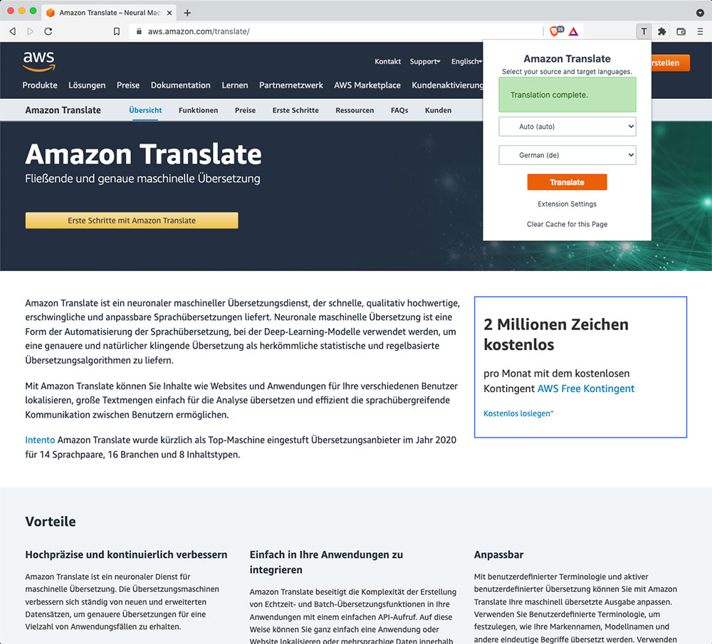

# Amazon Translate Browser Extension

This project is a browser extension for translating web pages using Amazon Translate. It primarily works in Chromium based browsers but also works with Firefox. Whenever you want to translate a web page, just simply select your source (automatic by default) and target language and hit translate. Your webpage will now be translated to the target language.

## What to Expect

This is the first release of the Amazon Translate Browser Extension and it is still a work in progress. It is not perfect right now and bugs should be expected, however, we will be working diligently to continually improve the experience.

## Google Play Store & Firefox Add-ons (Coming Soon)

We currently are working towards making this extension available in the Google Play Store and with Firefox Add-ons. We will update this readme when they are available. In the meantime, you can use this extension by following the manual installation steps below.

<!-- The easiest way to use this extension is to install the latest version from the [Google Play Store]() or from [Firefox Add-ons](). -->

## Tutorial

For a detailed tutorial on setting up the plugin, please refer to the following blog post:
[Use a Web Browser Plugin to Quickly Translate Text with Amazon Translate](https://aws.amazon.com/blogs/machine-learning/use-a-web-browser-plugin-to-quickly-translate-text-with-amazon-translate/)

## Manual Installation Steps (Chrome)

1. Navigate to the Github releases page [here](https://github.com/awslabs/amazon-translate-browser-extension/releases).
2. Download the latest version *zip file* and unzip it on your machine (it will unzip to the name "extension").
3. Open up the Chrome extension settings.
4. At the top-right of the extension settings screen, click the **Developer Mode** toggle.
5. On the developer toolbar click the **Load unpacked** button.
6. Navigate on your machine to the `extension` folder that you unzipped and then select it and click open.
7. You now have the extension installed in your browser.

## Guide

To use this extension you will need to follow the steps below:

1. Create a IAM user and assign it the `TranslateReadOnly` Policy.
2. Create an Access Key for this user for programmatic access.
3. Open the Amazon Translate Chrome Extension settings in your browser.
4. In the extension settings, select the region closest to you that supports the language pairs you desire to use.
5. Copy the **Access Key ID** from your IAM user access key and paste it into the appropriate spot in the extension settings.
6. Copy the **Secret Access Key** from your IAM user access key and paste it into the appropriate spot in the extension settings.
7. Click Save Settings.

After you have done this you can now use the extension popup to translate web pages using your provided password.

## Caching

In the extension settings you may notice there is an option to enable caching. When caching is enabled, any translations requested for a webpage
will be cached to your local machine by their language pairs. The next time you request to translate the same page with the same language pairs the
extension will pull the translation from your local machine rather than making any requests to the Amazon Translate service. This improves the speed
of the translation of the page and reduces the amount of requests made to the Amazon Translate service; thus saving you time and money.

If you would like to re-run a translation for a page, the extension popup should show a link that allows you to clear the cache for the current page.
Once the cache is cleared your next translate request will use the Amazon Translate service for a fresh translation. The new translation will now be cached.

## Contributing

Please read our contributing documentation before writing any code: [CONTRIBUTING.md](CONTRIBUTING.md)
