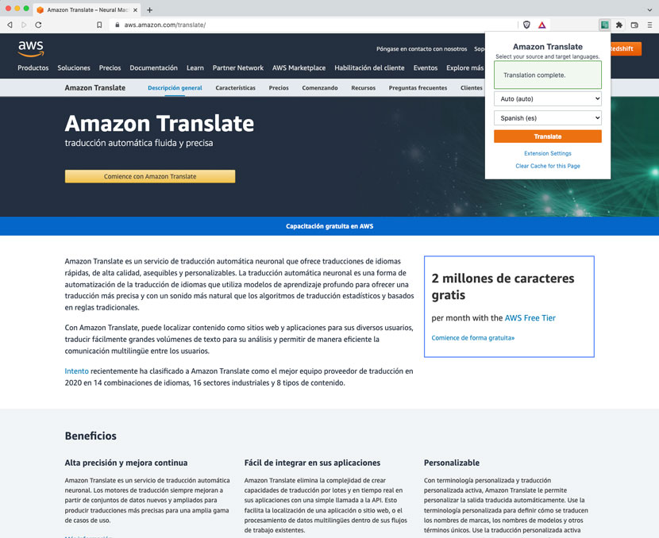

# Amazon Translate Chrome Extension

This project is a browser extension for translating web pages using Amazon Translate. It primarily works in Chromium based browsers but also works with Firefox. Whenever you want to translate a web page, just simply select your source (automatic by default) and target language and hit translate. Your webpage will now be translated to the target language.

## Installation Steps

1. Navigate to the releases folder in the repository [here](https://gitlab.aws.dev/sdt-northcentral-apps/browser-extension-amazon-translate/-/tree/main/releases).
2. Download the latest version zip file and unzip it on your machine (it will unzip to the name "extension").
3. Open up the Chrome extension settings.
4. At the top-right of the extension settings screen, click the **Developer Mode** toggle.
5. On the developer toolbar click the **Load unpacked** button.
6. Navigate to the clone repo on your machine and select the `extension` folder that you unzipped.
7. You now have the extension installed in your browser.

## Guide

To use this extension you will need to follow the steps below:

1. Create a IAM user through Isengard and assign it the `TranslateReadOnly` Policy.
2. Open the Amazont Translate Chrome Extension settings in your browser.
3. Create an Access Key for this user for programmatic access.
4. In the extension settings, select the region closest to you that supports the language pairs you desire to use.
5. Copy the **Access Key ID** and paste it into the appropriate spot in the extension settings.
6. Copy the **Secret Access Key** and paste it into the appropriate spot in the extension settings.
7. Click Save Settings.

After you have done this you can now use the extension popup to translate web pages using your provided password.

## Caching

In the extension settings you may notice there is an option to enable caching. When caching is enabled, any translations requested for a webpage
will be cached to your local machine by their language pairs. The next time you request to translate the same page with the same language pairs the
extension will pull the translation from your local machine rather than making any requests to the Amazon Translate service. This improves the speed
of the translation of the page and reduces the amount of requests made to the Amazon Translate service; thus saving you time and money.

If you would like to re-run a translation for a page, the extension popup should show a link that allows you to clear the cache for the current page.
Once the cache is cleared your next translate request will use the Amazon Translate service for a fresh translation. The new translation will now be cached.
